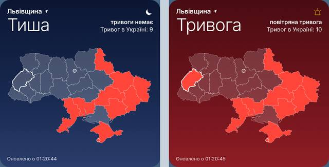

# Карта тривог — віджет для робочого столу macOS

Живий віджет-карта повітряних тривог в Україні для [Übersicht](https://tracesof.net/uebersicht/).
Дизайн зроблено у стилі великого віджета Apple «Погода».

*Ліворуч — звичайний стан, праворуч — тривога у вашій області.*

## Можливості

- Карта областей: червоні — зараз тривога, решта напівпрозорі.
- Ваша область обведена білим, її статус показано великим шрифтом угорі.
- Фон змінюється, як небо в «Погоді»: блакитний вдень, темно-синій вночі, темно-червоний під час тривоги у вашій області.
- Оновлення кожні 10 секунд.
- Якщо зникне інтернет, віджет покаже останній відомий стан.

## Встановлення

1. Встановіть [Übersicht](https://tracesof.net/uebersicht/) (або `brew install --cask ubersicht`) і запустіть його.
2. Скопіюйте папку `alerts-map.widget` у папку віджетів:
   `~/Library/Application Support/Übersicht/widgets/`
   (меню Übersicht → **Open Widgets Folder**).
3. Віджет з'явиться у правому верхньому куті робочого столу.

## Налаштування

На початку `alerts-map.widget/index.jsx`:

| Параметр | Що робить |
|---|---|
| `HOME` | ваша область, наприклад `'Львівська область'` |
| `ALERTS_IN_UA_TOKEN` | необов'язковий токен [alerts.in.ua](https://alerts.in.ua/api-request): тривоги по районах і громадах |
| `SCALE` | розмір віджета (`1` — як великий віджет Apple, `1.25` — більший) |
| `POSITION` | положення на екрані (CSS) |

## Джерела даних

- Тривоги по областях: відкритий API [ubilling.net.ua/aerialalerts](https://ubilling.net.ua/aerialalerts/), без токена.
- За наявності токена: [alerts.in.ua API](https://devs.alerts.in.ua/) (ліміт ~8–10 запитів на хвилину, тож 10 секунд — нормально).
- Межі областей: OpenStreetMap через [ukraine_geojson](https://github.com/EugeneBorshch/ukraine_geojson), спрощені скриптом `tools/build_map.py`.

> Віджет — неофіційний. Завжди орієнтуйтеся на офіційні сповіщення та застосунок «Повітряна тривога».
